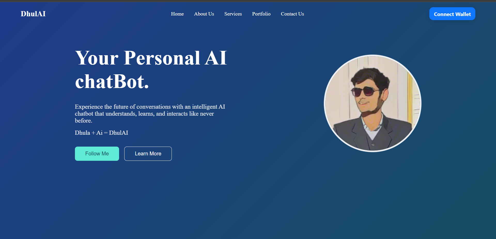
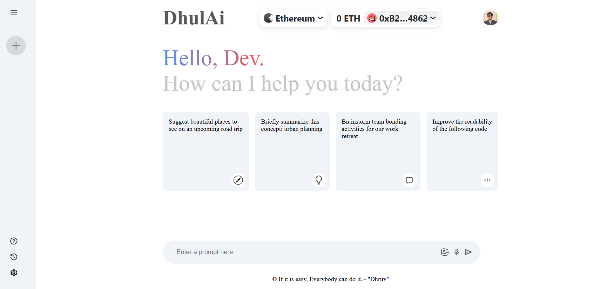
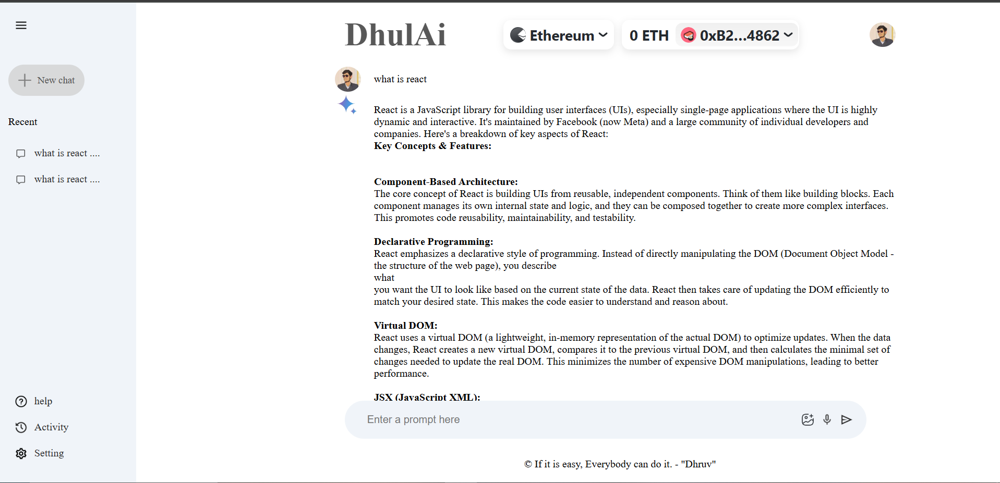

# DhulAi - Decentralized AI Chat

DhulAi is a React-based decentralized AI-powered chat application that ensures privacy, security, and efficiency in communication. This project leverages blockchain and AI technologies to provide users with seamless, real-time interactions without compromising their data.

## Features

- **Decentralized & Secure**: Uses blockchain for data integrity and user privacy.
- **AI-Powered Chat**: Generates meaningful and intelligent responses.
- **Real-Time Interaction**: Ensures smooth and engaging communication.
- **User-Friendly Interface**: Intuitive design for easy navigation.

## Live Demo

Visit the live application: [DhulAi](https://ai-chat-r2ezpmrk0-dhruvs-projects-91859a0e.vercel.app/)

## Demo Images

## Home Page



## Chat Home Page



## Chat Search Ui


## How to Clone and Run the Project

### Prerequisites
Ensure that you have the following installed on your machine:
- [Node.js](https://nodejs.org/) (v16 or higher)
- [Git](https://git-scm.com/)

### Steps to Clone and Run the App

1. **Clone the Repository:**
   Open your terminal/command prompt and run the following command to clone the project:
   ```bash
   git clone https://github.com/yourusername/DhulAi.git
   ```

2. **Navigate to the Project Directory:**
   Change into the project directory by running:
   ```bash
   cd DhulAi
   ```

3. **Install Dependencies:**
   Install the required dependencies using npm or yarn. You can use either one depending on your preference:
   
   - Using npm:
     ```bash
     npm install
     ```
   - Or using yarn:
     ```bash
     yarn install
     ```

4. **Run the Development Server:**
   After installing the dependencies, you can start the development server by running:
   
   - Using npm:
     ```bash
     npm run dev
     ```
   - Or using yarn:
     ```bash
     yarn dev
     ```

The application will be available at `http://localhost:3000` or your Default Port.

## Deployment
To deploy DhulAi, follow your preferred cloud service's deployment process, such as Vercel, Netlify, or a custom server setup.

## Contributing
We welcome contributions! Please submit a pull request or open an issue if you have suggestions or improvements.

## License
This project is licensed under the MIT License.

## Contact
For any inquiries, reach out to dhruvdobariya897@gmail.com

